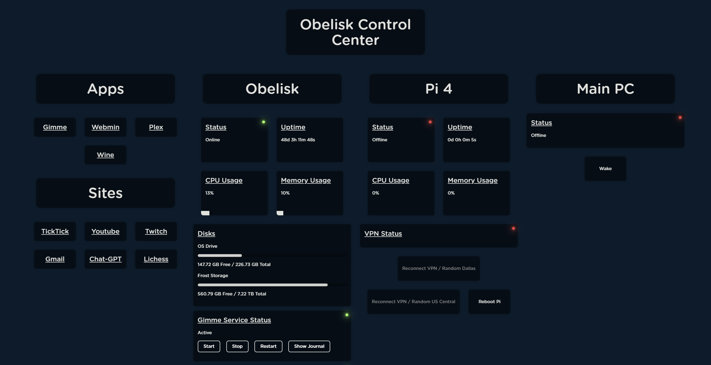

# Obelisk Control Center Frontend

Welcome to the Obelisk Control Center Frontend repository! This project serves as the frontend interface for monitoring and controlling a home server. It includes functionalities for monitoring devices, enabling/disabling services, handling torrents, and more.

## Project Description

This project is built using React and Vite, providing a minimal setup with Hot Module Replacement (HMR) and some ESLint rules. The main goal is to offer an intuitive and efficient way to manage various aspects of a home server.

## Features

- **Reusable Components**: Includes reusable components for displaying and controlling various functions of a home server.
- **Modals for Links**: Integrates modals for linking to your hosted web apps or external websites.
- **New Tab Page**: Functions excellently as a new tab page, providing quick access and control over your home server.

## Installation

To get started with the project, follow the steps below:

1. Clone the repository:
   ```sh
   git clone https://github.com/strnadchristopher/obelisk-control-center-frontend.git
   ```
2. Install the dependencies:
   ```sh
    npm install
    ```
3. Start the development server:
    ```sh
    npm run dev
    ```

## Screenshots

